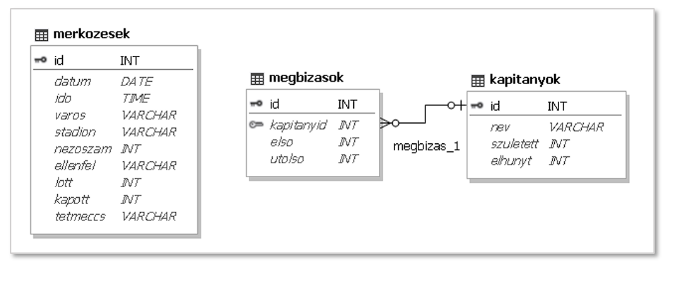

# 3. Válogatott

## 1. feladat
Készítsen új adatbázist `valogatott` néven!
A mellékelt három – tabulátorokkal tagolt, UTF-8 kódolású – szöveges állományt (`merkozes.txt`, `megbizas.txt`,
`kapitany.txt`) importálja az adatbázisba (**merkozesek**,
**megbizasok**, **kapitanyok**)! A létrehozás során állítsa be a megfelelő típusokat és az elsődleges kulcsokat!

### **merkozesek** (id, datum, ido, varos, stadion, nezoszam, ellenfel, lott, kapott, tetmeccs)
| Név          | Típus   | Leírás                                                     |
| :-:          | :-----: | ---------------------------------------------------------- |
| id           | int     | A mérkőzés azonosítója, ez a kulcs                         |
| datum        | date    | A mérkőzés dátuma                                          |
| ido          | time    | A mérkőzés kezdési ideje                                   |
| varos        | varchar | A város, ahol a mérkőzést játszották                       |
| stadion      | varchar | A stadion, ahol a mérkőzést játszották                     |
| nezoszam     | int     | A mérkőzés nézőszáma                                       | 
| ellenfel     | varchar | A mérkőzésen a magyar válogatott ellenfele                 |
| lott         | int     | A mérkőzésen a magyar válogatott által lőtt gólok száma    |
| kapott       | int     | A mérkőzésen a magyar válogatott által kapott gólok száma  |
| tetmeccs     | varchar | Megadja, hogy a mérkőzés milyen tétmeccs volt              |

### **megbizasok** (id, kapitanyid, elso, utolso)
| Név | Típus | Leírás                                                                                                                                  |
| :-: | :---: | --------------------------------------------------------------------------------------------------------------------------------------- |
| id  | int   | A szövetségi kapitányi megbízás azonosítója, ez a kulcs                                                                                 |
| kapitanyokid | int | Annak a szövetségi kapitánynak vagy válogató bizottságnak az azonosítója, akit megbíztak egy időre a válogatott összeállításával |
| elso | int | A mérkőzés azonosítója, egyúttal sorszáma, amelyen a megbízás először érvényes volt                                                      |
| utolso | int | A mérkőzés azonosítója, egyúttal sorszáma, amelyen a megbízás utoljára érvényes volt                                                   |

### **kapitanyok** (id, nev, szuletett, elhunyt)
| Név       | Típus   | Leírás                                                               |
| :-------: | :-----: | -------------------------------------------------------------------- |
| id        | int     | A szövetségi kapitány azonosítója, ez a kulcs                        |
| nev       | varchar | A szövetségi kapitány neve, aki a magyar válogatottat összeállította |
| szuletett | int     | A szövetségi kapitány születési éve                                  |
| elhunyt   | int     | A szövetségi kapitány halálozási éve                                 |

### Az adatbázis diagramja

## 2. feladat
Az adatbázis elkészítése óta játszódott egy meccs. Bővítse az adatbázist a 2016. 09. 06-án
játszódott focimeccs adataival!

## 3. feladat
A 2. feladatban lévő meccs lejátszása után adtak mégegy pontot a magyar válogatottnak.
Módosítsa a lőtt gólok számát 1-re!

## 4. feladat
Az adatbázis nem szükséges focimeccseket is tartalmaz.
Törölje az adatbázisból a barátságos mérkőzéseket!

## 5. feladat
A legrangosabb mérkőzések a VB, azaz a világbajnoksággal kapcsolatos meccsek.
Készítsen lekérdezést a ***tetmeccs*** mező felhasználásával, amely megjeleníti ezen
mérkőzések összes adatát! (Például az 1938-as világbajnoki selejtező *VB-sel-1938*
jelölésű.) (***2vb***)

## 6. feladat
Készítsen lekérdezést, amely megadja, hogy az 500. mérkőzésen ki volt a válogatott
szövetségi kapitánya! Csak a nevet jelenítse meg! (***3500***)

## 7. feladat
Készítsen lekérdezést, amely megadja, hogy ebben az évezredben (2001-től) mely ország
válogatottja ellen játszott a legtöbb néző előtt tétmérkőzést a magyar csapat! Jelenítse meg
a dátumot, az ellenfél nevét és a nézők számát! Ha több ilyen van, akkor elegendő csak
egyet megjeleníteni. (***4legtobb***)

## 8. feladat
Ausztria általában hasonló játékerőt képviselt, mint a magyar csapat, mégis előfordult, hogy
az eredményben nagy különbség mutatkozott. Készítsen lekérdezést, amely kilistázza
azokat a magyar-osztrák mérkőzéseket, amelyeken legalább 5 gól különbséggel nyert
valamelyik csapat! A dátum, a város, a lőtt és a kapott gólok száma jelenjen meg!
(***5ausztria***)

## 9. feladat
Készítsen lekérdezést, amely megadja az eddigi ellenfelek közül azokat, amelyeket mindig
legyőzött a magyar válogatott! Minden érintett ellenfél neve egyszer jelenjen meg!
(***6mindig***)

## 10. feladat
Készítsen jelentést, amely kilistázza a magyar válogatott Bicskei Bertalan irányítása mellett
játszott mérkőzéseit! A mérkőzéseket évenként csoportosítva jelenítse
meg, szövegszerű tartalmát tekintve
pedig az alábbi minta legyen a meghatározó! Biztosítsa, hogy minden
érték látható legyen! A jelentést lekérdezéssel készítse elő! (***7bicskei***)
